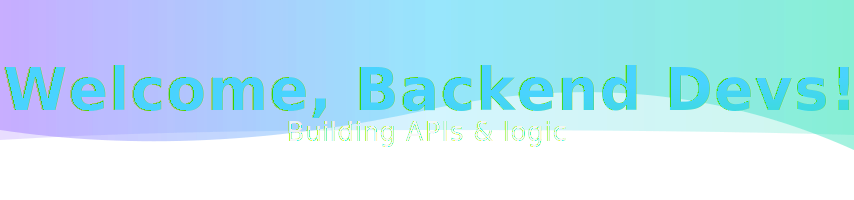

  

  <!-- badges -->
  

      
      
      
      
      
      
  

  

## 📚 Table of Contents
- [About Me](#about-me)
- [Tech Stack](#tech-stack)
- [🌟 Projects](#-projects)
- [🏅 HackerRank Badges](#-hackerrank-badges)
- [📫 Get in Touch](#-get-in-touch)
- [📈 GitHub Stats](#-github-stats)
- [🏆 Achievements](#-achievements)
- [🙌 Support Me](#-support-me)

## About Me

- 🛠️ Backend developer focused on building clean and efficient APIs.
- 🎓 Strong foundation in computer science and software development.
- ☕ Coffee and calisthenics enthusiast.

## Tech Stack

<table>
  <tr>
    <th>Property</th>
    <th>Data</th>
  </tr>
  <tr>
    <td><b>Languages / IDE</b></td>
    <td>
      
      
      
      
      
      
    </td>
  </tr>
  <tr>
    <td><b>Domain Knowledge</b></td>
    <td>
      
      
    </td>
  </tr>
  <tr>
    <td><b>CI / CD</b></td>
    <td>
      
      
      
      
    </td>
  </tr>
  <tr>
    <td><b>Databases</b></td>
    <td>
      
      
      
      
    </td>
  </tr>
</table>

## 🌟 Projects

- 🐍 [AI Snake Game](https://github.com/8ARTEZZIO/Snake-Game): A self‑playing Snake game written in Python.
- 🔐 [Password Manager](https://github.com/8ARTEZZIO/Password-Manager): A lightweight password manager for secure credential storage.

## 🏅 HackerRank Badges

Here are some of my certifications and accomplishments on [HackerRank](https://www.hackerrank.com/profile/b4rte4):

## 📫 Get in Touch

- **Email**: [b4rte4@gmail.com](mailto:b4rte4@gmail.com)
- **LinkedIn**: [Bartlomiej Kuźma](https://www.linkedin.com/in/bartlomiej-kuzma-9327a52a9/)

## 📈 GitHub Stats

## 🏆 Achievements

- 🎓 UDEMY: The Complete Python Bootcamp From Zero to Hero in Python by Jose Portilla
- 🎓 HARVARD: CS50's Introduction to Programming with Python
- 🎓 UDEMY: 100 Days of Code: The Complete Python Pro Bootcamp by Dr. Angela Yu

## 🙌 Support Me

If you find my work helpful, consider starring my repositories or following me for updates!

---

Thanks for visiting my profile! Let's connect and build something amazing together! 😊
